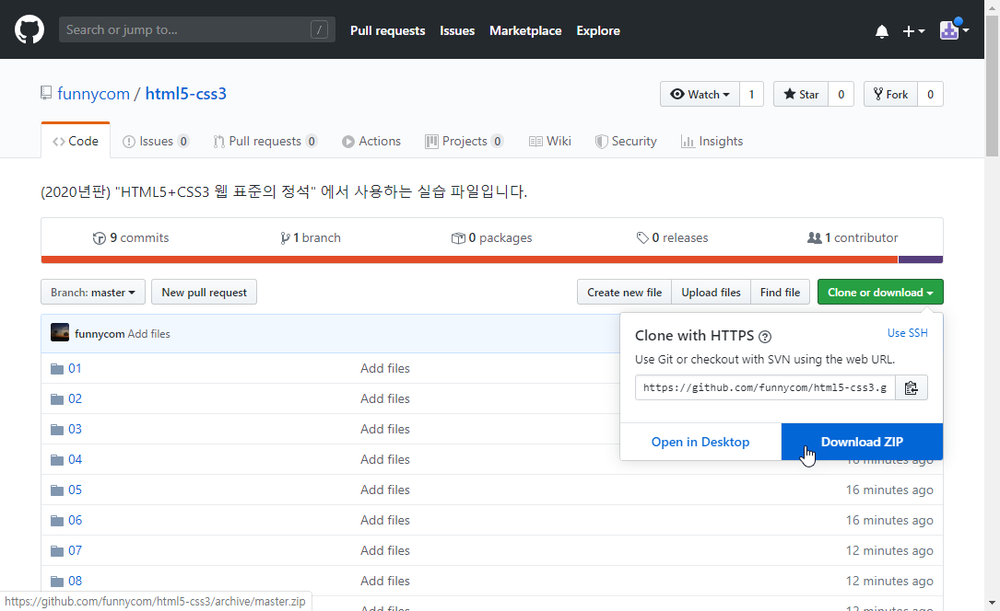

### (2020년판)

# [Do it! HTML5+CSS3 웹 표준의 정석] 소스 파일 다운로드 방법

---------------------------------------------

**현재 리포지토리에 올라와 있는 파일은 2020년판,  [Do it! HTML5+CSS3 웹 표준의 정석]의 실습 파일입니다.** 

1. 파일 목록 오른쪽 위에 있는 [Colone or download]를 클릭합니다.
2. [Download ZIP]을 클릭합니다.
3. 다운로드한 파일의 이름은 html5-css3-master.zip입니다. 적절한 이름으로 바꿔서 사용하세요.
4. 다운로드한 파일의 압축을 풉니다. 

----------------------------------------------
